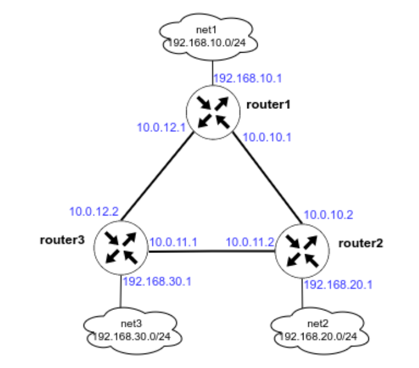

# OSPF

## Задание

1. Поднять три виртуальные машины.
2. Объединить их разными **vlan**.
3. Поднять **OSPF** между машинами на базе **FRR**.
4. Изобразить ассиметричный роутинг.
5. Сделать один из линков "дорогим", но что бы при этом роутинг был симметричным.

## Cхема сети



## Реализация

Задание сделано на **rockylinux/9** версии **v4.0.0**. Для автоматизации процесса написан **Ansible Playbook** [playbook.yml](playbook.yml) который последовательно запускает следующие роли:

- **nmcli** - устанавливает **IP** адреса на интерфейсах согласно значениям переменных **nmcli_connections** в файлах [router1.yml](host_vars/router1.yml), [router2.yml](host_vars/router2.yml) и [router3.yml](host_vars/router3.yml).
- **sysctl** - устанавливает параметры **sysctl** согласно значениям переменной **sysctl_conf** в [all.yml](group_vars/all.yml). Включает маршрутизацию и выключает блокировку ассиметричной маршрутизации на нужных интерфейсах.
- **frr** - устанавливает **frr 9** и настраивает его согласно переменным в [all.yml](group_vars/all.yml). Для файла `frr.conf` применяется шаблон [ospf.conf.j2](roles/frr/templates/ospf.conf.j2).

Используется **FRR 9**, так как **FRR 10** не совместим с **NetworkManager**, смотри проблему [NM and noprefixroute](https://gitlab.freedesktop.org/NetworkManager/NetworkManager/-/issues/1452).

**OSPF** настроен с учётом соображений безопасности. Используется аутентификация по алгоритму **hmac-sha-256**, кроме того интерфейсы **eth1** отмечены пассивными.

Для увеличения скорости сходимости сети **dead-interval** задан в 1 секунду, смотри **ip ospf dead-interval minimal hello-multiplier 4**.

## Запуск

Необходимо скачать **VagrantBox** для **rockylinux/9** версии **v4.0.0** и добавить его в **Vagrant** под именем **rockylinux/9/v4.0.0**. Сделать это можно командами:

```shell
curl -OL https://app.vagrantup.com/rockylinux/boxes/9/versions/4.0.0/providers/virtualbox/amd64/vagrant.box
vagrant box add vagrant.box --name "rockylinux/9/v4.0.0"
rm vagrant.box
```

Для того, чтобы **vagrant 2.3.7** работал с **VirtualBox 7.1.0** необходимо добавить эту версию в **driver_map** в файле **/usr/share/vagrant/gems/gems/vagrant-2.3.7/plugins/providers/virtualbox/driver/meta.rb**:

```ruby
          driver_map   = {
            "4.0" => Version_4_0,
            "4.1" => Version_4_1,
            "4.2" => Version_4_2,
            "4.3" => Version_4_3,
            "5.0" => Version_5_0,
            "5.1" => Version_5_1,
            "5.2" => Version_5_2,
            "6.0" => Version_6_0,
            "6.1" => Version_6_1,
            "7.0" => Version_7_0,
            "7.1" => Version_7_0,
          }
```

После этого нужно сделать **vagrant up**.

Протестировано в **OpenSUSE Tumbleweed**:

- **Vagrant 2.3.7**
- **VirtualBox 7.1.4_SUSE r165100**
- **Ansible 2.17.5**
- **Python 3.11.10**
- **Jinja2 3.1.4**

## Проверка

Проверим таблицы маршрутизации на всех узлах:

```text
❯ vagrant ssh router1 -c 'sudo vtysh -c "show ip route"'
Codes: K - kernel route, C - connected, S - static, R - RIP,
       O - OSPF, I - IS-IS, B - BGP, E - EIGRP, N - NHRP,
       T - Table, A - Babel, F - PBR, f - OpenFabric,
       > - selected route, * - FIB route, q - queued, r - rejected, b - backup
       t - trapped, o - offload failure

K>* 0.0.0.0/0 [0/100] via 10.0.2.2, eth0, src 10.0.2.15, 00:03:15
C>* 10.0.2.0/24 is directly connected, eth0, 00:03:15
O   10.0.10.0/30 [110/10000] is directly connected, eth2, weight 1, 00:03:13
C>* 10.0.10.0/30 is directly connected, eth2, 00:03:13
O>* 10.0.11.0/30 [110/200] via 10.0.12.2, eth3, weight 1, 00:02:50
O   10.0.12.0/30 [110/100] is directly connected, eth3, weight 1, 00:03:13
C>* 10.0.12.0/30 is directly connected, eth3, 00:03:13
O   192.168.10.0/24 [110/100] is directly connected, eth1, weight 1, 00:03:13
C>* 192.168.10.0/24 is directly connected, eth1, 00:03:13
O>* 192.168.20.0/24 [110/300] via 10.0.12.2, eth3, weight 1, 00:02:50
O>* 192.168.30.0/24 [110/200] via 10.0.12.2, eth3, weight 1, 00:02:50

❯ vagrant ssh router2 -c 'sudo vtysh -c "show ip route"'
Codes: K - kernel route, C - connected, S - static, R - RIP,
       O - OSPF, I - IS-IS, B - BGP, E - EIGRP, N - NHRP,
       T - Table, A - Babel, F - PBR, f - OpenFabric,
       > - selected route, * - FIB route, q - queued, r - rejected, b - backup
       t - trapped, o - offload failure

K>* 0.0.0.0/0 [0/100] via 10.0.2.2, eth0, src 10.0.2.15, 00:03:22
C>* 10.0.2.0/24 is directly connected, eth0, 00:03:22
O   10.0.10.0/30 [110/10000] is directly connected, eth2, weight 1, 00:03:21
C>* 10.0.10.0/30 is directly connected, eth2, 00:03:22
O   10.0.11.0/30 [110/100] is directly connected, eth3, weight 1, 00:03:21
C>* 10.0.11.0/30 is directly connected, eth3, 00:03:22
O>* 10.0.12.0/30 [110/200] via 10.0.11.1, eth3, weight 1, 00:02:58
O>* 192.168.10.0/24 [110/300] via 10.0.11.1, eth3, weight 1, 00:02:58
O   192.168.20.0/24 [110/100] is directly connected, eth1, weight 1, 00:03:21
C>* 192.168.20.0/24 is directly connected, eth1, 00:03:22
O>* 192.168.30.0/24 [110/200] via 10.0.11.1, eth3, weight 1, 00:02:58

❯ vagrant ssh router3 -c 'sudo vtysh -c "show ip route"'
Codes: K - kernel route, C - connected, S - static, R - RIP,
       O - OSPF, I - IS-IS, B - BGP, E - EIGRP, N - NHRP,
       T - Table, A - Babel, F - PBR, f - OpenFabric,
       > - selected route, * - FIB route, q - queued, r - rejected, b - backup
       t - trapped, o - offload failure

K>* 0.0.0.0/0 [0/100] via 10.0.2.2, eth0, src 10.0.2.15, 00:03:27
C>* 10.0.2.0/24 is directly connected, eth0, 00:03:27
O>* 10.0.10.0/30 [110/10100] via 10.0.11.2, eth3, weight 1, 00:03:03
  *                          via 10.0.12.1, eth2, weight 1, 00:03:03
O   10.0.11.0/30 [110/100] is directly connected, eth3, weight 1, 00:03:03
C>* 10.0.11.0/30 is directly connected, eth3, 00:03:08
O   10.0.12.0/30 [110/100] is directly connected, eth2, weight 1, 00:03:08
C>* 10.0.12.0/30 is directly connected, eth2, 00:03:08
O>* 192.168.10.0/24 [110/200] via 10.0.12.1, eth2, weight 1, 00:03:03
O>* 192.168.20.0/24 [110/200] via 10.0.11.2, eth3, weight 1, 00:03:03
O   192.168.30.0/24 [110/100] is directly connected, eth1, weight 1, 00:03:08
C>* 192.168.30.0/24 is directly connected, eth1, 00:03:08

```

Соединение между **router1** и **router2** дорогое (цена 10000), поэтому маршрутизаторы будут избегать его. Проверим это сделав трассировку внутренних **router1** и **router2**:

```text
❯ vagrant ssh router1 -c 'tracepath -n 192.168.20.1'
 1?: [LOCALHOST]                      pmtu 1500
 1:  10.0.12.2                                             0.383ms
 1:  10.0.12.2                                             0.127ms
 2:  192.168.20.1                                          0.321ms reached
     Resume: pmtu 1500 hops 2 back 2

❯ vagrant ssh router2 -c 'tracepath -n 192.168.10.1'
 1?: [LOCALHOST]                      pmtu 1500
 1:  10.0.11.1                                             0.208ms
 1:  10.0.11.1                                             0.106ms
 2:  192.168.10.1                                          0.257ms reached
     Resume: pmtu 1500 hops 2 back 2

```

Видно, что соединение идёт по длинному пути. Сделаем роутинг ассиметричным, удалив высокую цену интерфейса на **router1** (количество хопов **router1** уменьшится):

```text
❯ vagrant ssh router1 -c 'sudo vtysh -c "configure terminal" -c "interface eth2" -c "no ip ospf cost"'

❯ vagrant ssh router1 -c 'tracepath -n 192.168.20.1'
 1?: [LOCALHOST]                      pmtu 1500
 1:  192.168.20.1                                          0.131ms reached
 1:  192.168.20.1                                          0.133ms reached
     Resume: pmtu 1500 hops 1 back 1

❯ vagrant ssh router2 -c 'tracepath -n 192.168.10.1'
 1?: [LOCALHOST]                      pmtu 1500
 1:  10.0.11.1                                             0.351ms
 1:  10.0.11.1                                             0.162ms
 2:  192.168.10.1                                          0.257ms reached
     Resume: pmtu 1500 hops 2 back 1
```

Погасим интерфейс **eth3** и проверим маршрут от **router2** до и после этого:

```text
❯ vagrant ssh router2 -c 'tracepath -n 192.168.30.1'
 1?: [LOCALHOST]                      pmtu 1500
 1:  192.168.30.1                                          0.154ms reached
 1:  192.168.30.1                                          0.119ms reached
     Resume: pmtu 1500 hops 1 back 1

❯ vagrant ssh router3 -c 'sudo ip link set dev eth3 down'

❯ vagrant ssh router2 -c 'tracepath -n 192.168.30.1'
 1?: [LOCALHOST]                      pmtu 1500
 1:  10.0.10.1                                             0.189ms
 1:  10.0.10.1                                             0.137ms
 2:  192.168.30.1                                          0.297ms reached
     Resume: pmtu 1500 hops 2 back 2
```
